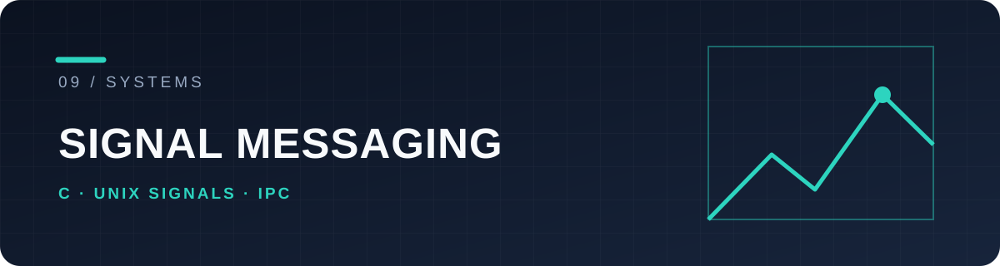

# minitalk

A client and server that exchange a message one bit at a time using Unix `SIGUSR1` and `SIGUSR2`. This 42 project explores signal handlers, process IDs and basic inter-process communication.

## Protocol at a glance

```text
client: character → bits → SIGUSR1 / SIGUSR2 → server: bits → character
```

The server prints its PID; the client targets that PID and sends a string. The protocol and timing are visible in [`client.c`](client.c) and [`server.c`](server.c).

## Run it

On a Unix-like system with a C compiler and Make:

```sh
make
./server
```

In another terminal, use the PID printed by the server:

```sh
./client <server-pid> "Hello, 42"
```

Signals are a deliberately constrained transport for this exercise. They are not a general-purpose replacement for sockets or message queues. [License](LICENSE).
